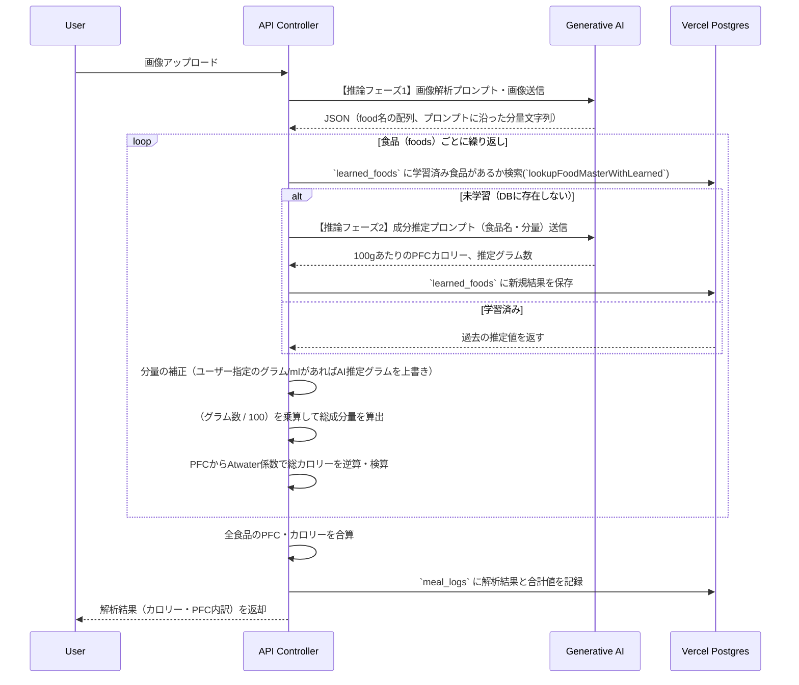
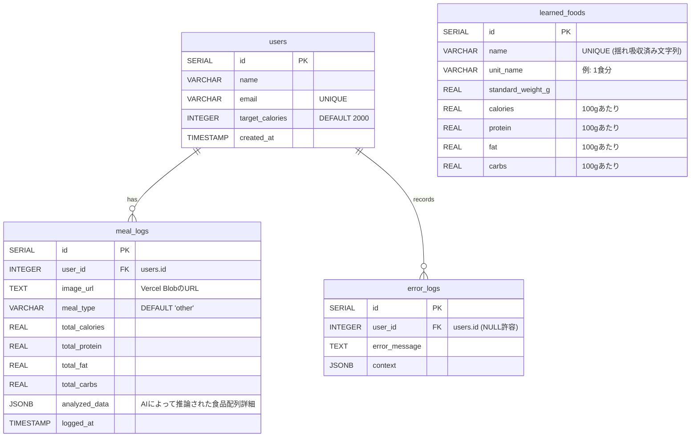

# 食事解析・栄養成分算出 現状分析ドキュメント

本ドキュメントは、LogEatsにおける画像およびテキストプロンプトからの料理名特定、カロリーおよびPFC（タンパク質・脂質・炭水化物）の算出ロジックの現状仕様をまとめたものです。
今後の精度向上施策に向けた現状分析のベースとして活用します。

---

## 1. 全体概要とシステム機能構成

LogEatsの食事解析は、ユーザーからの入力（画像、テキスト）を起点として、**AIを用いた2段階の推論プロセス（認識フェーズ・推定フェーズ）**を経て栄養データを生成・記録します。Webアプリケーション（Next.js）およびLINE Botからの両方の経路に対応しています。

### 1-1. 機能構成図 (システムアーキテクチャ)

```mermaid
graph TD
    subgraph Client
        UI[Webブラウザ UI]
        LINE[LINE Bot]
    end

    subgraph API Route & Controllers
        API_Analyze[POST /api/analyze]
        API_LINE[POST /api/webhooks/line]
    end

    subgraph LLM Services
        Agent_Vision/LLM[Gemini 3.1 Flash / GPT-4o-mini]
    end

    subgraph Core Logic
        recognizeFoods[料理・食品特定処理\n(recognizeWith...)]
        estimateNutrition[栄養素推定処理\n(estimateNutritionWithAI)]
        calculateValues[カロリー計算・PFC検算]
    end

    subgraph Storage / DB
        LearnedFoods_DB[(learned_foods テーブル)]
        MealLogs_DB[(meal_logs テーブル)]
        VercelBlob[(Vercel Blob\n画像ストレージ)]
    end

    UI -->|画像送付| API_Analyze
    LINE -->|画像送付| API_LINE
    API_LINE --> API_Analyze

    API_Analyze --> recognizeFoods
    recognizeFoods <-->|画像＋プロンプト| Agent_Vision/LLM
    
    recognizeFoods --> |特定された食品名・分量目安| estimateNutrition
    estimateNutrition <-->|未学習の場合| Agent_Vision/LLM
    estimateNutrition <-->|学習済みの参照・保存| LearnedFoods_DB

    estimateNutrition --> |食品の基本栄養素・重量| calculateValues
    calculateValues --> |計算済みのPFC・カロリー| MealLogs_DB
    API_Analyze --> |画像ファイルの保存| VercelBlob
```

---

## 2. 処理フロー

画像を受け取ってからデータベースに記録されるまでの詳細な機能フローです。



---

## 3. 解析ロジックの詳細仕様

### 3-1. 【推論フェーズ1】食品認識 (Image to Foods)

マルチモーダルAI（デフォルト：Gemini 3.1 Flash-Lite, 設定に応じてGPT-4o-mini）を用いて画像から料理名・食品名を抽出します。

- **役割**: 画像全体の文脈判断（食事かそれ以外か）、調理法の推測、分量の目視推計（1杯、1切れ、パッケージ商品の特定）。
- **出力**:
  - `foods` 配列（`name`: 食品名, `amount`: 例 "茶碗1杯(約150g)"）
  - `is_ambiguous` (不鮮明、食事以外のフラグ)
- **現状の課題/精度向上ポイント**: 
  - 画像に複数の料理が写っている場合の漏れや、調味料の過小評価。
  - プロンプトレベルで市販の商品などを明確に指定させているが、さらに具体的な「サイズ」の推計をAIに強制させるかどうかの調整の余地。

### 3-2. 【推論フェーズ2】栄養価推定 (Foods to Nutrition)

DBに登録されていない新規食品名称が登場した際に呼び出されます。

- **役割**: 「日本食品標準成分表（八訂）」の知識ベースを前提とし、対象食品（調理法・味付けを考慮）の100gあたりの各PFC成分値と、指定された分量の「推定重量(g)」を出力します。
- **データ構造**:
  ```json
  {
    "estimated_weight_g": 150,
    "per_100g": { "calories": 156, "protein": 2.5, "fat": 0.3, "carbs": 37.1 }
  }
  ```
- **現状のDB連携戦略 (`learned_foods`)**:
  一度AIによって推論された成分はDBに永続化されます。同じ食品名（表記揺れ吸収済み）が入力された場合、推論をスキップすることでAPIコスト削減とレスポンスタイム向上を図っています。

### 3-3. カロリーの算出と検算（Atwater係数）

取得した「100gあたりの成分値」と「推定重量（またはユーザー指定重量）」を掛け合わせ、最終的な値を算出します。
AIは直接「カロリー値」を出力することもできますが、ハルシネーション（情報の矛盾）を防ぐために**独自のコードによる検算ルーチン**を挟んでいます。

1. **基本重量の決定**: `weightG = masterRecord.standard_weight_g` (AIの推測したグラム数)
2. **ユーザー指定の優先 (Override)**:
   もし分量文字列 (`amount`) の中に「〇〇g」「〇〇ml」と明記されている場合、正規表現で合致した数値を優先して `weightG` に上書きします。
3. **成分量の算出**: `(weightG / 100) * per_100gの値` でPFCを算出。
4. **カロリー検算 (Validate & Calculate)**:
   算出されたタンパク質(x4)、脂質(x9)、炭水化物(x4) の結果を足し合わせ、これを最終的な「総カロリー」として採用します。

---

## 4. データベース構成 (スキーマ)

精度向上施策やデータ分析に関わる中心的なテーブル群のER構成です。



### 【主要テーブル解説】
- **`learned_foods`**: 
  解析結果の精度と速度を決定づけるマスターDBです。精度向上のためには、このテーブルに「明らかに不自然な成分値」が紛れ込んでいないかを定期的に監査・修正する仕組み（Admin画面からの編集機能など）の導入が重要になります。
- **`meal_logs`**:
  `analyzed_data`（JSONB）の中に、実際に識別された個別の食品リストとその計算結果が保存されています。将来のモデル改善時に、このJSONデータを評価用データセットとして再利用することが可能です。
